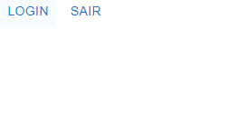
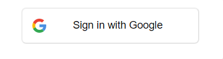
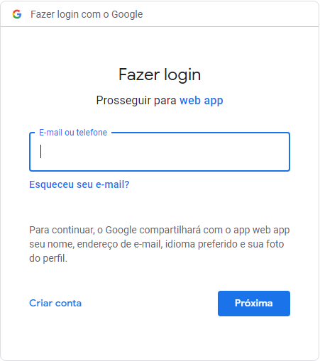
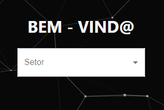
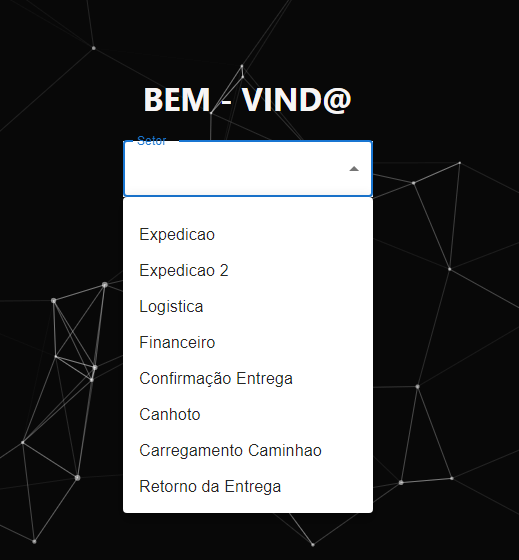
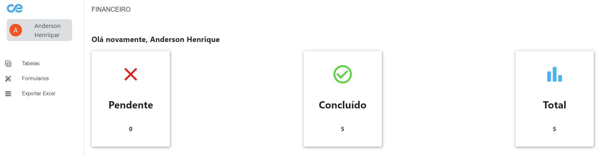

# Como fazer Login

Nesse exemplo voçê verá como fazer login

Quando voçê receber a URL do sistema voçê irá se deparar com essa tela:



Ao Clicar em **LOGIN** voçê irá para tela de logins:



Ao Clicar em **Sign in with Google** voçê deverá escolher uma conta da google para fazer login ou colocar conta existente:



Pronto! Você está logado.


## Boas vindas:
Agora sua tela será essa: 



Ao Clicar em <code>Setor</code> sua tela será essa:



Agora só clicar em seu determinado setor e o codigo fará o resto!
**Diga Tchau Tchau porque essa tela nunca mais aparecerá para voçê**



```mdx title="EM CASO DE ADM"
# Contate Gerente TI para mudar seu setor manualmente.
```

## Tela Home

Bem-Vindo a tela de Home(**Tela Principal**):
<br/>
Vamos exemplificar com o setor <code>FINANCEIRO</code>